# Building a Recommender System With Yelp Dataset
---

## Problem Statement

- Trying out new restaurants is often time a hit or miss. Relying solely on business ratings and popularities can sometimes lead you to a 'tourist trap' place. Combining business ratings and distribution of review ratings (texts) can significantly increase your chance of landing a good restaurant. However, this process can be very time-consuming. 
- This project aims to build and construct a personalized recommender system that can quickly predict potential ratings someone would give a restaurant based on user similarities shared among other users.

# Datasets
---

* [`business.csv`]: Filtered Yelp business dataset with open restaurants in Massachusett. (Large file size, cannot be uploaded to Github, the original dataset is available on the Yelp website.)

* [`reviews.csv`]: Filtered Yelp reviews dataset with reviewers who left reviews for restaurants in Massachusett. (Large file size, cannot be uploaded to Github, the original dataset is available on the Yelp website.)

* [`yelp_academic_dataset_business.json`](https://www.yelp.com/dataset): The original dataset can be downloaded from the link.

* [`yelp_academic_dataset_review.csv`](https://www.yelp.com/dataset): The original dataset can be downloaded from the link.

    - Yelp open dataset with 8,635,403 reviews, 160,585 businesses, and 8 metropolitan areas. 

# Data Dictionary
---

- 
|Feature|Type|Dataset|Description|
|---|---|---|---|
|**business_id**|*Object*|business| Business identification code|
|**name**|*Object*|business|Name of the business| 
|**business_stars**|*Integer*|business|Overall ratings received by the business, scale from 1-5, increments of 0.5|
|**review_count**|*Integer*|business|Total number of reviews received by business|
|**user_id**|*Object*|reviews|Name of the business| 
|**review_stars**|*Integer*|review|Star ratings per review, scale from 1-5, increments of 1|
|**date**|*Object*|review|Date the review was posted, timespan from October 2004 to January 2021|

# Data description and visualization
---

- Number of new reviews over time on a time series plot. There is a continuous increase in the number of reviews per month over the years, and some seasonality trends. 

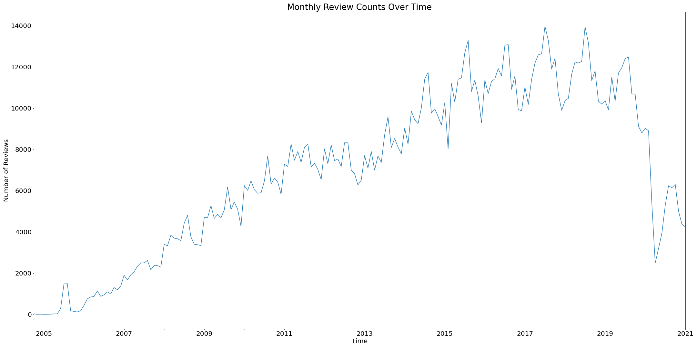


- Grouping the reviews by months helps us examine that seasonality from previous time series plot. July and August have significantly higher amount of reviews than the rest of the year, suggesting that people tends to eat out and write reviews during the summer.

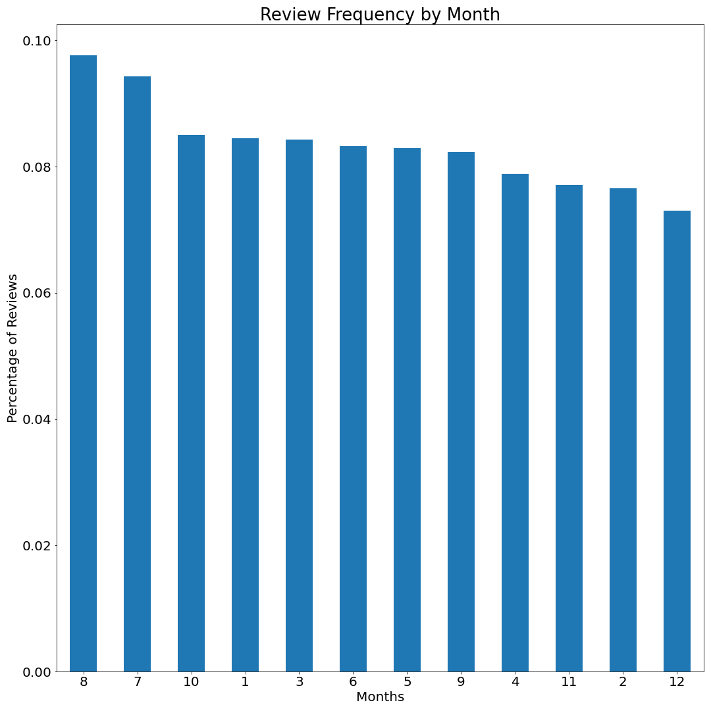


- The distribution of restaurant ratings in Massachusett on a map. The horizontal and vertical lines intersect at one of the landmark in city center, the Boston Common. Each dot represents a restaurant, and the darker the dot, the higher the restaurant ratings. The map shows that most restaurants cluster near the city center, and the different rating dots are scattered on the map with no significant patterns.  

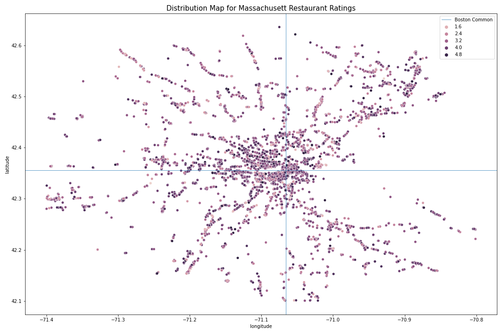


- The following two distribution plots show the top 10 restaurants with the most reviews, and their average ratings. 

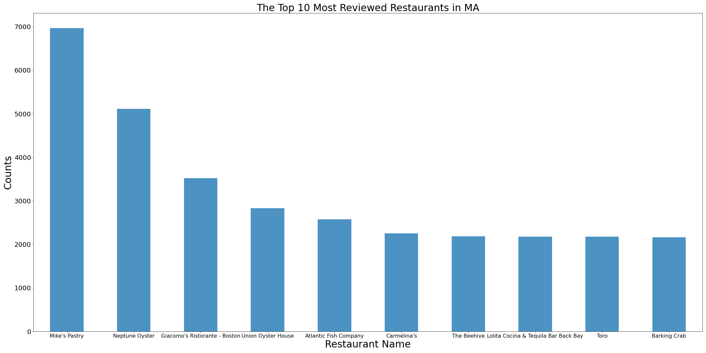

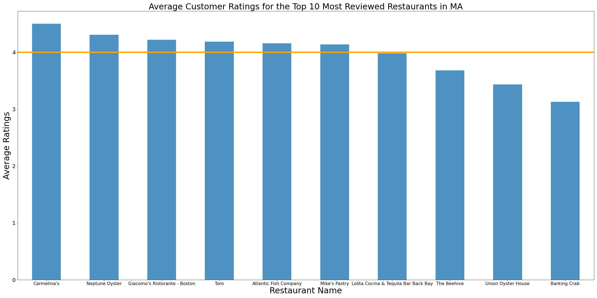

- The overall busines ratings are normally distributed with a mean of around 4.

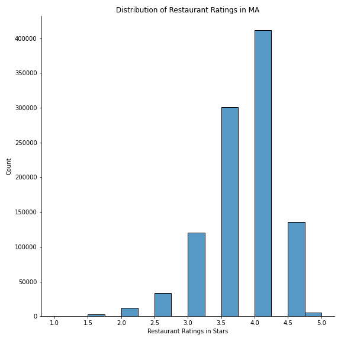

- The overall review ratings count increases as the review stars increase. With an out-of-trend total number in the 1-star rating column.

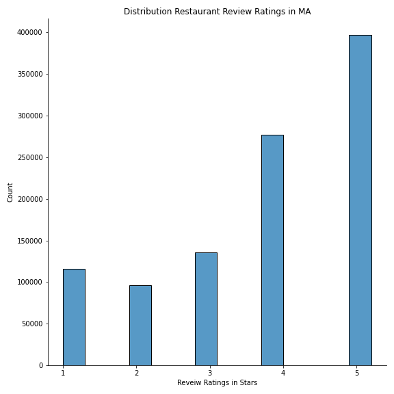

- Normalized overall rating distribution.

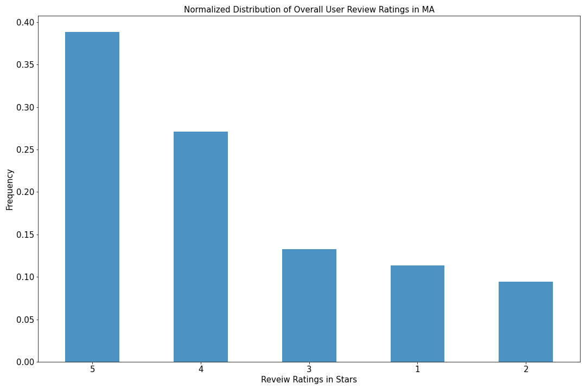

- The following two normalized distribution plots showing review tendency of users with total comment of 1, and users with total comment of 5. It takes five 

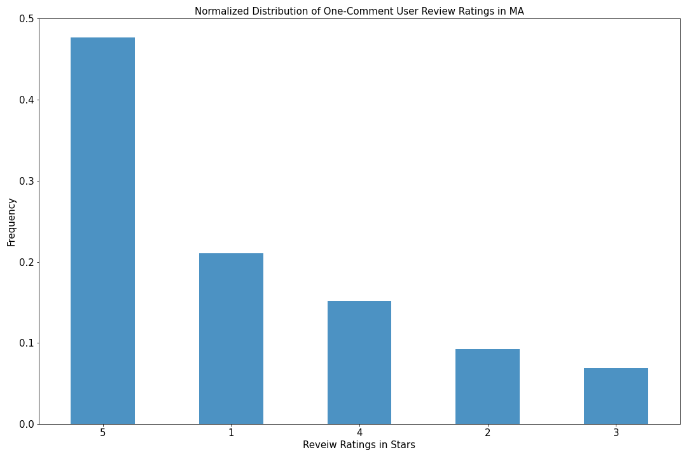


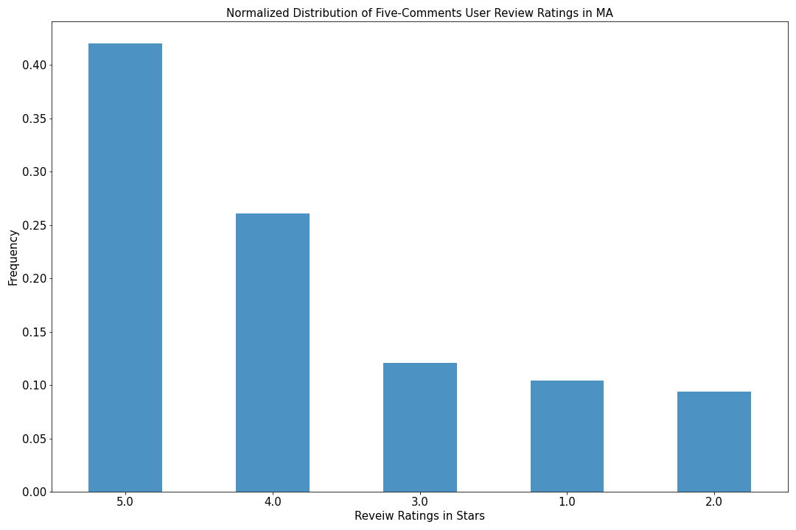


# Modeling 
---
- Item-based collaborative filtering recommender system: 
    - Give recommendations based on similarities between pairs of items. 
    - Sample result using the item-based collaborative filtering system: The top 10 closest restaurants to restaurant name 'Mike's Pastry' according to cosine-distance between the two businesses. The smaller the distance, the higher the similarity.
    
        ```
        Mike's Pastry
        Average rating 4.060698167081146
        Number of ratings 3619

        10 closest restaurants
        name
        Modern Pastry Shop               0.782920
        Giacomo's Ristorante - Boston    0.806610
        Neptune Oyster                   0.817108
        Flour Bakery + Café              0.848353
        Regina Pizzeria                  0.849679
        Boston Chowda                    0.854806
        Union Oyster House               0.862944
        Quincy Market                    0.863544
        The Daily Catch                  0.866183
        Legal Sea Foods                  0.873152
        Name: Mike's Pastry, dtype: float64
        ```
    
- User-based collarborative filtering recommender system:
    - Give user recommendations based on similarities between pairs of users. 
    - Sample result using the user-based collaborative filtering system: The top 10 closest users to user id 'pIyQA5HsHg-_XJ07hvju6Q' according to cosine-distance between the two users. The smaller the distance, the higher the similarity. 
    
        ```
        pIyQA5HsHg-_XJ07hvju6Q
        Average rating 4.4
        Number of ratings 5

        10 closest users
        user_id
        7G3aPclKS14hYcyi1UZmSg    0.544777 
        6Yworw3wCXcUewDFEtqbsA    0.561471
        wW_y1iJWiEMKISRnRS6JHQ    0.649321
        KQIRAraxB98jegoGejfZqA    0.656728
        ulySjSR_mlYnHBMDwBHoyw    0.663267
        aLP9za6SsG-pDkGl32Oq-g    0.693030
        1eLYK0WfkGqJQ1Pacqi6gg    0.702718
        Id5iBlKYnQDl5sk6fpEeNg    0.709066
        GRIGHT1GynVFUGy8F2hMYQ    0.710971
        SYrsS0IkSUAEs4aQTiK4zg    0.719776
        Name: pIyQA5HsHg-_XJ07hvju6Q, dtype: float64

        ```
    
    
-  Cosine similarity measures by the cosine of the angle between two vectors to determine whether the two vectors are pointing in roughly the same direction. it is equivalent to 1 - cosine_distance. 


# Cross-validation with built-in surprise algorithms 
['Surprise_Prediction_Algorithms']('https://surprise.readthedocs.io/en/stable/prediction_algorithms_package.html')
---

|  Algorithms  | Mean : RMSE, MAE | STD: RMSE, MAE | Mean: Fit Time |
|:------------:|:----------------:|:--------------:|:--------------:|
|     SVD      |  1.1265 , 0.8973 | 0.0011, 0.0002 |      18.31     |
|    SVDpp     |  1.1300, 0.8971  | 0.0012, 0.0007 |      54.38     |
| CoClustering |  1.2394, 0.9353  | 0.0011, 0.0004 |      10.73     |
|   KNNBasic   |  1.2832, 1.0197  | 0.0011, 0.0007 |      53.56     |
|      NMF     |  1.3043, 1.0149  | 0.0012, 0.0005 |      19.26     |
|   SlopeOne   |  1.3229, 0.9939  | 0.0024, 0.0013 |      1.90      |
| KNNWithMeans |  1.3633, 1.0328  | 0.0054, 0.0057 |     49.34      |

- The 3 k-fold cross validations were performed with 50% of the total dataset for efficiency. 
- The KNNBasic and KNNWithMeans can only perform with 20% of the full dataset with Google Colab+, otherwise is likely to crash. 

- SVD: Equivalent to Probablistic Matrix Factorization
- SVDpp: Extension of SVD that takes into account implicit ratings. 
- KNNBasic: K-NN basic collaborative filtering algorithm.
- KNNWithMeans: K-NN basic collaborative filtering algorithm, taking into account the mean ratings of each user. 
- NMF: A collaborative filtering algorithm based on non-negative Matrix Factorization. 
- SlopeOne: Propose three related slope one schemes with preictors of the form f(x) = x + b, which precompute the average differene between the ratings of one item and another for users who rated both. [Source]('https://arxiv.org/abs/cs/0702144')
- CoClustering: A collaborative filtering algorithm based on co-clustering. 


# Model selection
-----------------
- SVD model has the lowest mean RMSE, and mean MAE score. The differences between the two scores are also small, suggusting the variance in the individual errors in the sample is also low. 
- The SVD model is also the fastest model out of all the algorithms tested, we are able to train test split with the full dataset. 
- 70:30 train_test_split results:

|  Algorithms      |  RMSE  |   MAE  |
|------------------|:------:|:------:|
|        SVD       | 1.1107 | 0.8785 |
| SVD GridSearchCV | 1.1164 | 0.8866 |
    
    
# Predictions
-------
- Distributuion of the actual review ratings in the testset.

 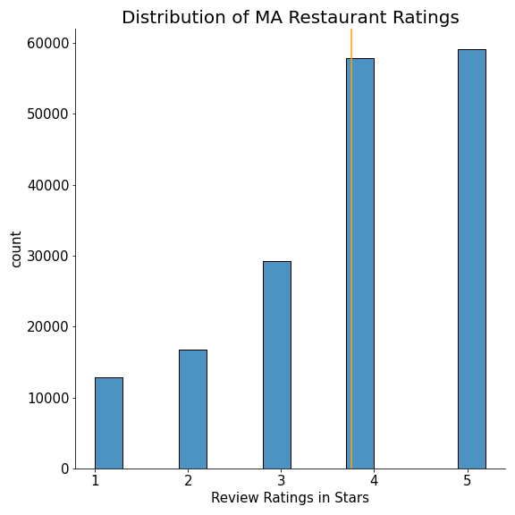


- Distribution of estimated review ratings in the testset. 

 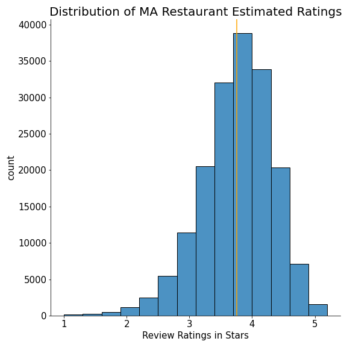


# Next Step
---------------
- One drawback of the surprise svd model is that the results follow a normal distribution. The model is not likely to estimate the extremes. 
- For the next step, I would like to learn and try other varieties of recommender system models. I want to examine content-based filtering to estimate business ratings. Maybe use NLP to evaluate the review texts and draw similarities there, or neural network to build another recommender system. 
- In the mean time, I want to look into building applications, such as the Streamlit app, to put the recommender system into function. 


